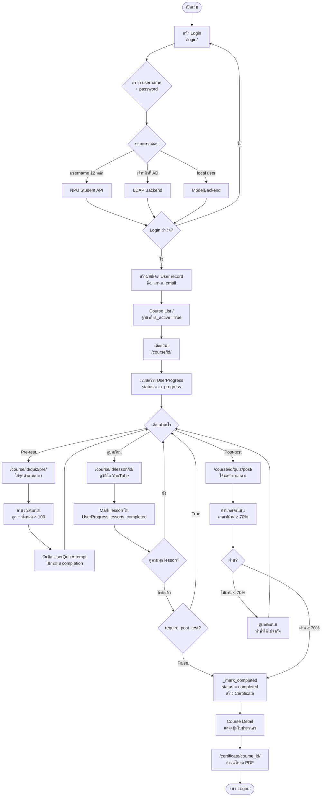
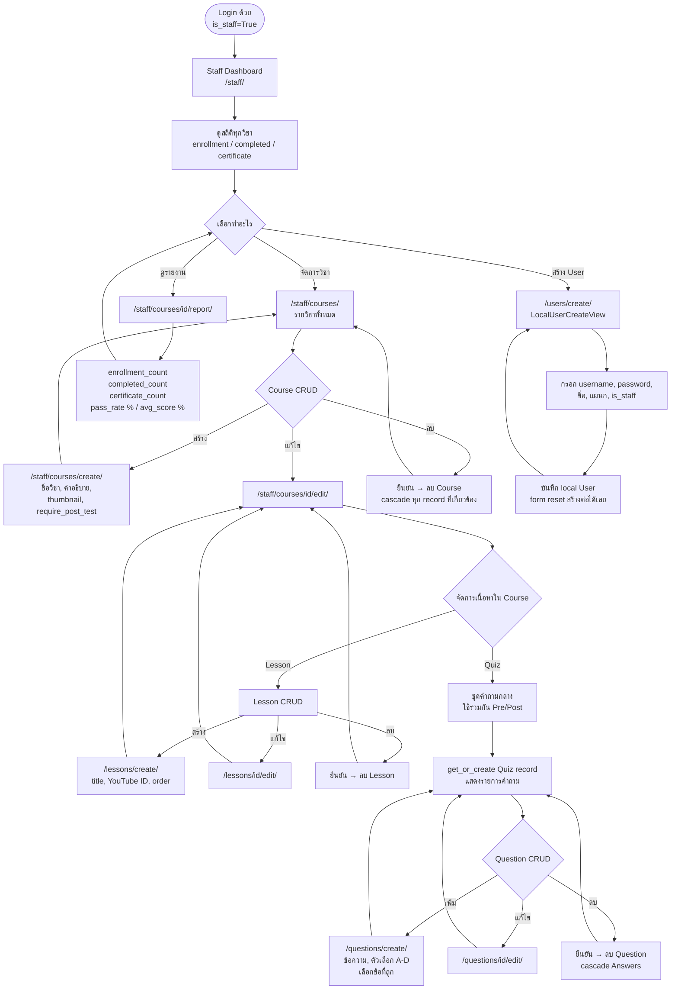

# LMS Flow Diagrams

## Flow 1: นักศึกษา

```mermaid
flowchart TD
    A([เปิดเว็บ]) --> B[หน้า Login\n/login/]
    B --> C{กรอก username\n+ password}
    C --> D{ระบบตรวจสอบ}
    D -->|username 12 หลัก| E[NPU Student API]
    D -->|เจ้าหน้าที่ AD| F[LDAP Backend]
    D -->|local user| G[ModelBackend]
    E & F & G --> H{Login สำเร็จ?}
    H -->|ไม่| B
    H -->|ใช่| I[สร้าง/อัปเดต User record\nชื่อ, แผนก, email]
    I --> J[Course List /\nดูวิชาที่ is_active=True]
    J --> K[เลือกวิชา\n/course/id/]
    K --> L[ระบบสร้าง UserProgress\nstatus = in_progress]
    L --> M{เลือกทำอะไร}

    M -->|Pre-test| N["/course/id/quiz/pre/\nใช้ชุดคำถามกลาง"]
    N --> O[คำนวณคะแนน\nถูก ÷ ทั้งหมด × 100]
    O --> P[บันทึก UserQuizAttempt\nไม่กระทบ completion]
    P --> M

    M -->|ดูบทเรียน| Q["/course/id/lesson/id/\nดูวิดีโอ YouTube"]
    Q --> R[Mark lesson ใน\nUserProgress.lessons_completed]
    R --> S{ดูครบทุก lesson?}
    S -->|ยัง| M
    S -->|ครบแล้ว| T{require_post_test?}
    T -->|False| U[_mark_completed\nstatus = completed\nสร้าง Certificate]
    T -->|True| M

    M -->|Post-test| V["/course/id/quiz/post/\nใช้ชุดคำถามกลาง"]
    V --> W[คำนวณคะแนน\nเกณฑ์ผ่าน ≥ 70%]
    W --> X{ผ่าน?}
    X -->|ไม่ผ่าน < 70%| Y[ดูผลคะแนน\nทำซ้ำได้ไม่จำกัด]
    Y --> M
    X -->|ผ่าน ≥ 70%| U

    U --> Z[Course Detail\nแสดงปุ่มใบประกาศฯ]
    Z --> AA["/certificate/course_id/\nดาวน์โหลด PDF"]
    AA --> AB([จบ / Logout])
```

## Flow 2: เจ้าหน้าที่

```mermaid
flowchart TD
    A([Login ด้วย\nis_staff=True]) --> B[Staff Dashboard\n/staff/]
    B --> C[ดูสถิติทุกวิชา\nenrollment / completed / certificate]
    C --> D{เลือกทำอะไร}

    D -->|จัดการวิชา| E["/staff/courses/\nรายวิชาทั้งหมด"]
    E --> F{Course CRUD}
    F -->|สร้าง| G["/staff/courses/create/\nชื่อวิชา, คำอธิบาย,\nthumbnail, require_post_test"]
    F -->|แก้ไข| H["/staff/courses/id/edit/"]
    F -->|ลบ| I[ยืนยัน → ลบ Course\ncascade ทุก record ที่เกี่ยวข้อง]
    G & I --> E

    H --> J{จัดการเนื้อหาใน Course}

    J -->|Lesson| K[Lesson CRUD]
    K -->|สร้าง| L["/lessons/create/\ntitle, YouTube ID, order"]
    K -->|แก้ไข| M["/lessons/id/edit/"]
    K -->|ลบ| N[ยืนยัน → ลบ Lesson]
    L & M & N --> H

    J -->|Quiz| O[ชุดคำถามกลาง\nใช้ร่วมกัน Pre/Post]
    O --> R[get_or_create Quiz record\nแสดงรายการคำถาม]
    R --> S{Question CRUD}
    S -->|เพิ่ม| T["/questions/create/\nข้อความ, ตัวเลือก A-D\nเลือกข้อที่ถูก"]
    S -->|แก้ไข| U["/questions/id/edit/"]
    S -->|ลบ| V[ยืนยัน → ลบ Question\ncascade Answers]
    T & U & V --> R

    D -->|ดูรายงาน| W["/staff/courses/id/report/"]
    W --> X[enrollment_count\ncompleted_count\ncertificate_count\npass_rate % / avg_score %]
    X --> D

    D -->|สร้าง User| Y["/users/create/\nLocalUserCreateView"]
    Y --> Z[กรอก username, password,\nชื่อ, แผนก, is_staff]
    Z --> AA[บันทึก local User\nform reset สร้างต่อได้เลย]
    AA --> Y
```
